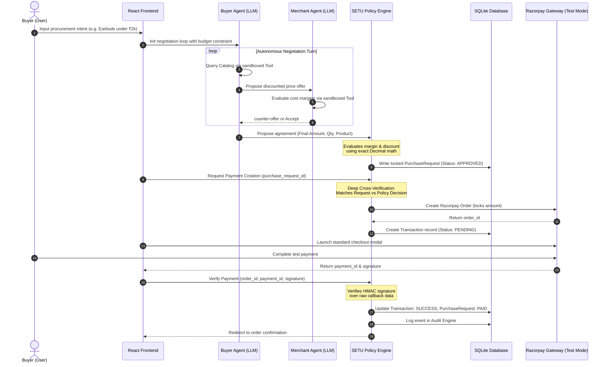

# SETU — AI Commerce Trust Layer

[]()
[]()
[]()
[]()
[]()
[]()
[]()

> A secure AI-to-AI commerce trust layer where agents can negotiate autonomously while deterministic policy controls and Razorpay securely govern every money movement.

---

## 1. Project Identity and Problem Statement

SETU is a production-quality trust layer designed for AI-driven growth and agentic commerce. 

As autonomous AI agents are granted purchasing power and integrated into commercial ecosystems, they must interact with external merchant APIs and transaction gateways. Traditional integration models introduce severe vulnerabilities:
* **Direct Credential Risk**: Granting LLMs direct access to gateway keys inevitably leads to credentials leaking via prompt injection or output extraction.
* **Value Manipulation**: Prompt injection attacks can trick an agent into proposing a nominal payment (e.g. ₹1.00) for a high-value item.
* **Infinite Negotiation Loops**: Unbounded AI-to-AI dialog leads to agent deadlocks, consuming excessive token budgets and computing resources.
* **Untrusted Execution**: Letting agents compile or execute payment API calls directly introduces high risk.
* **Lack of Validation**: Standard gateways lack mechanisms to verify whether an AI-generated decision conforms to internal business rules, budget limits, or discount policies.

---

## 2. Core Project Idea

SETU addresses these challenges by separating the *Proposer* (the AI agents) from the *Decider* (the deterministic backend Policy Engine). The AI agents operate in a sandboxed runtime environment, discovering products and negotiating deals, but they do not possess transaction authorization credentials or payment gateways capabilities.

> [!IMPORTANT]
> **"LLMs propose. They do not authorize."**
> 
> The AI model provides probabilistic intelligence for intent understanding and negotiation. SETU's deterministic backend independently validates policy, pricing, budget, and payment conditions before any transaction is authorized.

---

## 3. Key Features

* **Sandboxed Tool Registries**: Agents can only execute allowed, strictly restricted information-retrieval functions.
* **Server-Side Transaction Locking**: Financial amounts are validated, locked, and recorded in the database before checkout is initiated, blocking frontend price manipulation.
* **Deterministic Policy Engine**: Business policies (budgets, margin floors, and discount limits) are evaluated using exact Python math.
* **HMAC Webhook Verification**: Cryptographic validation of payment events ensures that the transaction state updates to captured only on verified callback signatures.
* **Audit Logging**: Every action, tool call, policy evaluation, and payment transition is logged to a persistent table, providing a complete, inspectable transaction ledger.
* **Model Abstraction**: Supports both live LLM mode and offline mock mode for fully deterministic fallback testing.

---

## 4. Architecture

The following diagram illustrates the flow of requests, separation of responsibilities, and how SETU securely validates transactions:



---

## 5. Buyer and Merchant Agent Workflow

1. **Procurement Intent**: The Buyer Agent parses the user's requirements, formulates search parameters, and queries the catalog for matching items.
2. **Offer Formulation**: Based on catalog listings and its allocated budget constraint, the Buyer Agent generates a starting bid.
3. **Offer Assessment**: The Merchant Agent receives the bid and checks inventory availability.
4. **Margin Evaluation**: The Merchant Agent evaluates the proposed unit price against catalog product costs and its minimum margin requirements.
5. **Acceptance or Counter**: If the offer meets the profitability floor, the Merchant Agent accepts. Otherwise, it generates a counter-offer at the lowest compliant price point, returning it to the Buyer Agent.
6. **Iterative Loops**: The agents converse via a structured orchestrator for up to four turns. The negotiation resolves when a mutual price is agreed upon or when the maximum rounds are reached without consensus.

---

## 6. Deterministic SETU Policy Engine and Trust Layer

The SETU Policy Engine is a separate Python module that evaluates agreements using exact `Decimal` arithmetic. It operates independently of the configured AI model:

* **Budget Enforcement**: Blocks transactions if the negotiated total exceeds the budget constraint initially provided by the user.
* **Discount Validation**: Evaluates the proposed price reduction percentage against policy limits, blocking any discounts exceeding maximum allowed caps.
* **Margin Validation**: Compares final revenue against unit cost parameters, blocking transactions that fall below minimum margin percentages.
* **Approval Gating**: Transactions exceeding standard value thresholds are flagged as `REQUIRES_APPROVAL` and gated until manually approved by an administrator.

AI agents are restricted from accessing this evaluation code, database records, or payment credentials, making policy bypass impossible.

---

## 7. Negotiation and Decision Flow

* **Step 1 (Propose)**: The Buyer Agent agrees to a final price with the Merchant Agent.
* **Step 2 (Record)**: The Buyer Agent requests a purchase, creating a `PurchaseRequest` record in the database.
* **Step 3 (Evaluate)**: The backend invokes the Policy Engine. It returns `APPROVED`, `BLOCKED`, or `REQUIRES_APPROVAL`.
* **Step 4 (Admin Override)**: If flagged for admin approval, the transaction remains locked. An admin can trigger manual approval to update the state to `APPROVED`.
* **Step 5 (Lock)**: The system generates an immutable `PolicyDecision` snapshot retaining all verified parameters.

---

## 8. Razorpay Test Mode Payment Integration

Once a transaction is approved by the Policy Engine, the frontend initiates checkout:

1. **Server-Side Order Creation**: The backend retrieves the approved request, verifies that all parameters match the `PolicyDecision` snapshot, and calls the Razorpay API to generate a secure order ID.
2. **Amount Conversion**: The server converts the validated decimal amount to paise (e.g. `amount * 100`) to guarantee that the checkout widget opens with the exact price resolved by the Policy Engine.
3. **Checkout Initialization**: The React client mounts the standard Razorpay Checkout widget populated with the secure order ID.
4. **Callback Signature Verification**: Upon completion, the client returns payment metadata. The backend verifies the cryptographic HMAC signature:
   `HMAC-SHA256(order_id + "|" + payment_id, key_secret)`
5. **Idempotency Protection**: Webhook endpoints capture `order.paid` and `payment.captured` events, checking the event ID against the database `ProcessedWebhookEvent` table to prevent duplicate captures.
6. **Settle**: On successful verification, the database marks the transaction as `SUCCESS` and the purchase request as `PAID`.

---

## 9. Security and Trust Boundaries

| Risk Vector | SETU Protection | Implementation Detail |
| :--- | :--- | :--- |
| **AI Overspending** | Budget boundary enforcement | Evaluated deterministically in the Policy Engine against the user's allocated budget limit. |
| **Excessive Discounting** | Discount policy enforcement | Proposals exceeding the maximum discount cap are marked as `BLOCKED`. |
| **Low-Profit Transaction** | Minimum margin validation | Proposals resulting in a profit margin below minimum floors are blocked. |
| **Unapproved Purchase** | Transaction state gating | Only requests in the `APPROVED` state can generate payment orders. |
| **Client Amount Tampering** | Server-side amount locking | Razorpay order amount is fetched directly from the database record snapshot, ignoring frontend input. |
| **Invalid Payment Callback** | Signature verification | Server verifies the HMAC SHA256 signature using the key secret before marking the transaction as success. |
| **Duplicate Webhook Events** | Webhook idempotency protection | Tracked via a processed events table to ensure payment processing is executed exactly once. |
| **Unauthorized Action** | Gated Agent registries | The tool schema registry blocks agents from accessing payment APIs or database modification methods. |
| **Prompt Injection Attacks** | Audit & Security override | Prompt injections are contained inside the sandbox; the backend verification logic validates the transaction data. |
| **Lack of Traceability** | Database-persistent audit logging | All events are saved in `audit_events` ledger for strict reporting. |

---

## 10. Technology Stack

### Frontend
* **Core**: React with TypeScript
* **Routing**: React Router DOM
* **Build System & Dev Server**: Vite
* **Styling**: Tailormade HSL CSS
* **Icons**: Lucide React

### Backend
* **Web Framework**: FastAPI
* **ASGI Server**: Uvicorn
* **Database**: SQLite with SQLAlchemy ORM
* **Validations**: Pydantic
* **Testing Framework**: Pytest

### Payments & AI
* **Payment Integration**: Razorpay Python SDK
* **AI Provider**: LLM Provider Adapter supporting live LLM and mock modes

---

## 11. Project Structure

```
SETU-AI-to-AI-agent/
├── backend/
│   ├── app/
│   │   ├── agents/
│   │   │   ├── prompts/           # Persona configuration prompts
│   │   │   │   ├── buyer_system.txt
│   │   │   │   └── merchant_system.txt
│   │   │   ├── buyer_agent.py     # Buyer Agent class & Tool Registry
│   │   │   ├── merchant_agent.py  # Merchant Agent class & Tool Registry
│   │   │   ├── orchestrator.py    # Autonomous negotiation round loop
│   │   │   ├── provider.py        # LLM adapter & Offline Mock Provider
│   │   │   └── tools.py           # Sandboxed Agent Tool functions
│   │   ├── audit.py               # Ledger audit logger
│   │   ├── config.py              # Environment variable settings
│   │   ├── database.py            # SQLite connection setup
│   │   ├── models.py              # SQLAlchemy DB model definitions
│   │   ├── payments.py            # Razorpay SDK adapters & amount locking
│   │   ├── policy.py              # Deterministic Python Policy Engine
│   │   ├── schemas.py             # Pydantic schemas for request validation
│   │   ├── webhooks.py            # Webhook signature & Idempotency guards
│   │   └── main.py                # FastAPI endpoints entrypoint
│   ├── requirements.txt           # Python backend dependencies
│   └── seed.py                    # Database seeding script
├── frontend/
│   ├── src/
│   │   ├── components/
│   │   │   ├── negotiation/       # Procurement UI panels & timeline
│   │   │   └── shopping/          # Catalog shopping UI cards
│   │   ├── pages/                 # Home, Procurement, & Checkout views
│   │   ├── App.tsx                # React routes mapping
│   │   └── main.tsx               # Client entry mount
│   ├── package.json               # Frontend dependencies & npm scripts
│   └── vite.config.ts             # Vite server configurations
├── tests/                         # Pytest test suites (93 test cases)
│   ├── integration/               # Webhooks, demo flows & concurrency tests
│   ├── security/                  # Prompt injection & amount-tampering tests
│   └── unit/                      # Policy, Razorpay, & Agent isolated tests
├── .env.example                   # Shared env template
└── README.md                      # Buildathon documentation
```

---

## 12. Installation and Setup

### Prerequisites
* Python installed.
* Node.js and npm installed.

### Setup Steps

1. **Clone the Repository**
   ```bash
   git clone https://github.com/THILAKESWARAN07/SETU-AI-to-AI-agent.git
   cd SETU-AI-to-AI-agent
   ```

2. **Configure Virtual Environment & Dependencies**
   ```bash
   python -m venv venv
   # On Windows (PowerShell):
   .\venv\Scripts\Activate.ps1
   # On Linux/macOS:
   source venv/bin/activate

   pip install -r backend/requirements.txt
   ```

3. **Configure Environment Variables**
   Create a `.env` file in the root directory. You can copy the template:
   ```bash
   cp .env.example .env
   ```
   Modify `.env` variables using secure keys (see [Environment variables](#environment-variables) below).

4. **Initialize Database**
   The database schema is initialized and seeded automatically with demo catalog products and merchant policies when the FastAPI server starts up. (Database initialization code runs on application lifespan startup).

---

## 13. Environment Configuration

Configure your `.env` variables as follows:

```env
# AI Model Provider Configurations
LLM_PROVIDER=gemini                     # Options: 'gemini', 'openai', 'mock'
GEMINI_API_KEY=your_gemini_api_key      # Required for live mode
LLM_MODEL=gemini-3.6-flash              # Configured model name
LLM_FALLBACK_TO_MOCK=True               # Fallback if API rate limits hit

# Payment Gateway Configurations
PAYMENT_MODE=razorpay                   # Options: 'razorpay', 'mock'
RAZORPAY_MODE=test                      # Enforces test checkout
RAZORPAY_KEY_ID=rzp_test_xxxxxxxxx     # Your Razorpay Test Key ID
RAZORPAY_KEY_SECRET=your_key_secret     # Your Razorpay Test Key Secret
RAZORPAY_WEBHOOK_SECRET=your_webhook    # Optional webhook validation secret

# Database Configurations
DATABASE_URL=sqlite:///./setu.db

# Cryptographic token signing secret key
SECRET_KEY=your_secret_key
```

---

## 14. Running the Application

1. **Start backend API Server**
   ```bash
   uvicorn backend.app.main:app --reload
   ```
   The backend API will run at `http://localhost:8000`.

2. **Start React Frontend**
   Open a separate terminal window:
   ```bash
   cd frontend
   npm install
   npm run dev
   ```
   The application dashboard will run at `http://localhost:5173`.

---

## 15. Testing

The test suite validates agent tools, policy engine calculations, security blocks, concurrency, and checkout. Run tests using the mock provider configuration:

```powershell
# Set mock provider and run pytest
$env:LLM_PROVIDER="mock"; python -m pytest
```

Output should show all **93 passing tests**:
```
tests/integration/test_concurrency.py .
tests/integration/test_demo_flow.py .......
tests/integration/test_e2e_flow.py ..
tests/integration/test_webhook.py ....
tests/security/test_security.py ...........
tests/security/test_step12_security.py ....
tests/unit/test_agents.py .........................................
tests/unit/test_policy.py .......
tests/unit/test_razorpay.py ..........
tests/unit/test_step11.py ......
=========================== 93 passed in ~13s ===========================
```

---

## 16. Future Scope / Roadmap

Future production roadmap enhancements include:

* **Production Database**: Migrate from SQLite to PostgreSQL.
* **Role-Based Authentication**: Integrate OAuth2 token auth for human administrators.
* **Merchant Onboarding**: Implement self-service merchant onboarding.
* **Multi-Merchant Catalog**: Allow comparative search across multiple merchant stores.
* **Administrative Override Panel**: Build a rich interface for pending approval decisions.
* **Fraud Risk Engine**: Add machine-learning-based transaction risk classification.
* **Marketplace Integrations**: Expand support to other agent registries and payment channels.

---

## 17. Conclusion

> **SETU does not trust AI agents with unrestricted financial authority.**
>
> **AI agents can understand, negotiate, and propose.**
>
> **The deterministic trust layer decides what is allowed.**
>
> **The backend locks the financial terms.**
>
> **Razorpay securely executes the payment.**
