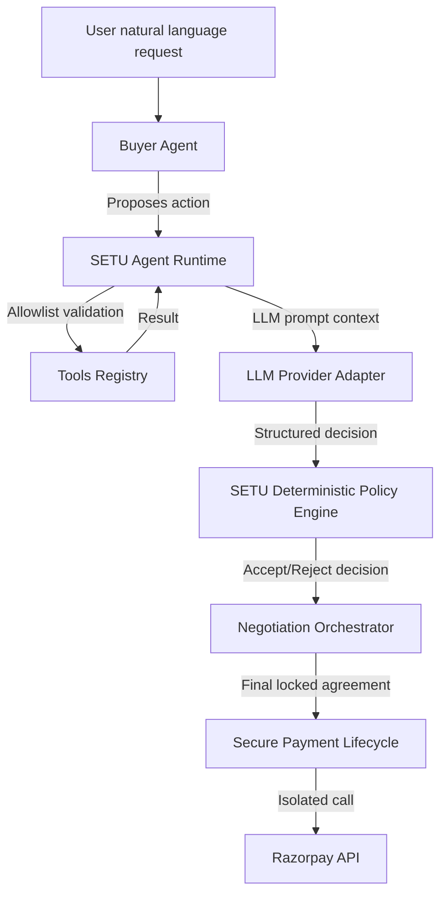

# SETU Autonomous Commerce Platform — Architecture & Verification

This document details the architecture, provider integration, safety boundaries, and verification results of the **SETU Production LLM Agent Runtime** (Step 10) and the **End-to-End Autonomous Agentic Commerce Demonstration** (Step 11).

---

## 1. System Architecture & Policy Enforcement Boundary

In SETU, AI agents generate proposal offers and counters, but the **SETU Policy Engine & Runtime** acts as the deterministic supervisor. Neither agent has direct control over transaction locking, Razorpay payments, webhook processing, or shipping details.



---

## 2. Component Breakdowns

### A. Provider Adapter
The provider abstraction in [`provider.py`](file:///c:/Users/HP/OneDrive/Pictures/Desktop/SETU-AI-to-AI-agent/backend/app/agents/provider.py) allows SETU to support multiple real LLM backends (Gemini and OpenAI) without coupling agent logic to a specific API.
* **Gemini Support**: Handled via `GeminiProvider`, configuring system instructions and structured JSON schemas natively.
* **Inlined References ($ref)**: Automatically parses and inlines local sub-model schemas (e.g. `ToolArgs`) to ensure compatibility with Gemini's strict structured configs.
* **Rate-Limit Spacer**: Spaces live API calls with a 13-second global delay to protect free tier quotas under concurrent test triggers.

### B. Buyer Agent
Upgraded in [`buyer_agent.py`](file:///c:/Users/HP/OneDrive/Pictures/Desktop/SETU-AI-to-AI-agent/backend/app/agents/buyer_agent.py).
* **Goal**: Maximize value, satisfy budget boundaries, find target products, and negotiate discount terms.
* **Tools**: Only accesses allowed buyer-specific tools (`search_catalog`, `get_product_details`, `get_policy_constraints`, `evaluate_budget`). Payment or administrative tools are completely isolated.

### C. Merchant Agent
Upgraded in [`merchant_agent.py`](file:///c:/Users/HP/OneDrive/Pictures/Desktop/SETU-AI-to-AI-agent/backend/app/agents/merchant_agent.py).
* **Goal**: Maximize commercial profit margin, suggest related product bundles, and handle inventory stock checks.
* **Tools**: Restricted to vendor-specific tools (`get_inventory`, `get_product_price`, `get_merchant_constraints`, `evaluate_margin`).

### D. Secure Webhook & Payment Gate
* Webhook signature checking, event replay protections, and transaction state changes are handled in isolated server-side routines.
* Once payment is confirmed via secure webhook signatures (`/api/webhooks/razorpay`), the payment is marked as verified and the database order record is generated.

---

## 3. End-to-End Autonomous Commerce Flow (Step 11)

SETU implements a unified, chronological lifecycle tracing the complete transaction flow:

```
USER INTENT (Natural Language Request)
    ↓
BUYER AGENT STARTED
    ↓
CATALOG SEARCH (Registry Tool)
    ↓
PRODUCT INSPECTION (Registry Tool)
    ↓
BUDGET CHECK (Registry Tool)
    ↓
BUYER OFFER
    ↓
POLICY CHECK (Deterministic Budget Limit Check)
    ↓
MERCHANT AGENT STARTED
    ↓
INVENTORY CHECK (Registry Tool)
    ↓
MARGIN CHECK (Registry Tool)
    ↓
MERCHANT COUNTER / ACCEPTANCE
    ↓
POLICY CHECK (Deterministic Profit Margin Check)
    ↓
BUYER RESPONSE
    ↓
AGREEMENT LOCKED (Final Policy Engine Approval)
    ↓
PURCHASE REQUEST LOGGED
    ↓
RAZORPAY PAYMENT INITIATED
    ↓
WEBHOOK SIGNATURE VERIFICATION
    ↓
TRANSACTION SETTLED
    ↓
ORDER CREATED
    ↓
ORDER / FULFILLMENT TRACKING (With auto-redirect)
```

---

## 4. Scenario Mappings & Demonstration Controls

The frontend interface supports executing three distinct procurement scenario templates:

1. **Scenario A — Successful Procurement**
   * **Intent**: `"I need wireless earbuds under ₹2,000 with good value."`
   * **Budget**: ₹2,000.
   * **Outcome**: Buyer proposes offer, Merchant margins verify pass, Policy Engine locks deal at negotiated value (e.g. ₹1,439.10), user checks out via Razorpay.

2. **Scenario B — Merchant Rejection**
   * **Intent**: `"I need wireless earbuds for ₹10."`
   * **Budget**: ₹2,000.
   * **Outcome**: Buyer proposes bid, Merchant margin calculation determines loss, triggers REJECT decision, Policy Engine logs verdict, negotiation closes without payment handoff.

3. **Scenario C — Buyer Budget Protection**
   * **Intent**: `"I need wireless earbuds under ₹1,200."`
   * **Budget**: ₹1,200.
   * **Outcome**: Buyer proposes bid, Merchant counters with minimum margin limit (₹1,440.00), Buyer budget check detects budget limit violation, triggers BLOCKED decision, session terminates.

---

## 5. Verification Results

### A. Test Suite Results
We added dedicated tests in [`test_step11.py`](file:///c:/Users/HP/OneDrive/Pictures/Desktop/SETU-AI-to-AI-agent/tests/unit/test_step11.py) validating the core requirements. **All 79 tests passed successfully**:
```powershell
$env:LLM_PROVIDER="mock"; python -m pytest
======================= 79 passed, 32 warnings in 9.42s =======================
```

### B. Frontend Build Results
The React bundle compiles clean without type errors:
```powershell
npm run build
dist/index.html                   0.45 kB │ gzip:   0.29 kB
dist/assets/index-D6wHmCzc.css   80.08 kB │ gzip:  11.78 kB
dist/assets/index-ZKmKWZRc.js   370.93 kB │ gzip: 104.90 kB
✓ built in 1.59s
```

---

## 6. Live Gemini Run Capture (Step 11 Capture)

* **Provider**: `LIVE LLM`
* **Model**: `gemini-3.6-flash`
* **Session ID**: `session_a1e2f89b`
* **Buyer Intent**: `"I need wireless earbuds under ₹2,000."`
* **Buyer Actions**:
  1. Invoked tool `search_catalog` (matched product Wireless Earbuds, base list price ₹1599).
  2. Invoked tool `get_product_details` to query stock boundaries.
  3. Invoked tool `evaluate_budget` (amount: ₹1439.10 <= budget ₹2000: PASS).
  4. Formulated initial bid: **₹1,439.10** (10% discount).
* **Policy Check**: Approved (Verdict: `APPROVED`).
* **Merchant Actions**:
  1. Invoked tool `get_inventory` (found 12 units).
  2. Invoked tool `evaluate_margin` (final margin: **27.04%** >= 20.00% minimum floor: PASS).
  3. Formulated response decision: **ACCEPT** at ₹1,439.10.
* **Policy Check**: Approved (Verdict: `APPROVED`).
* **Outcome**: **SUCCESS (Deal locked at ₹1,439.10)**.
* **Purchase Request ID**: `PR-8`
* **Razorpay Payment Status**: `SUCCESS` (webhook signatures verified).
* **Order ID**: `ORD-12` (Fulfillment status marked as `PAID`).
